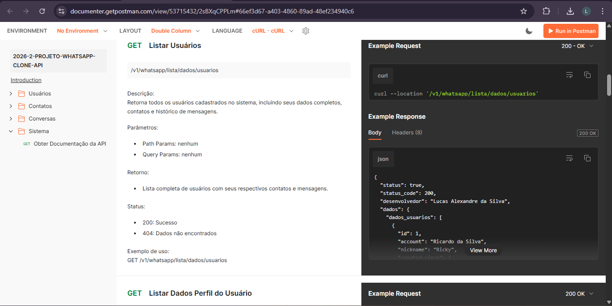

# API Documentation — WhatsApp Clone API REST

<p align="center">
  
</p>

Documentação técnica resumida da API responsável pelo gerenciamento de usuários, contatos e conversas.

**Documentação completa (Postman):**  
https://documenter.getpostman.com/view/53715432/2sBXqCPPLm#66ef3d67-a403-4860-89ad-48ef234940c6

## 🌐 Base URLs

- Local:  
  http://localhost:8080

- Produção:  
  https://whatsapp-api-s5tm.onrender.com/

## 📦 Padrão de resposta

### Sucesso
```json
{
  "status": true,
  "status_code": 200,
  "desenvolvedor": "Lucas Alexandre da Silva",
  "dados": {}
}
```
### Error
```json
{
  "status": false,
  "status_code": 400,
  "desenvolvedor": "Lucas Alexandre da Silva",
  "message": "Descrição do erro"
}
```

## Status Codes

| Código | Descrição |
|--------|----------|
| 200    | Sucesso |
| 400    | Parâmetros inválidos |
| 404    | Dados não encontrados |

## Regras da API

- Todos os endpoints utilizam o método **GET**
- Parâmetros obrigatórios devem ser informados corretamente
- Query params devem ser enviados via URL
- A API não possui autenticação
- Os dados são simulados via JSON (sem banco de dados)

## Endpoints

### Usuários

- `GET /v1/whatsapp/lista/dados/usuarios`  
  → Lista todos os usuários  

- `GET /v1/whatsapp/dados/perfil/usuario/:numeroUsuario`  
  → Retorna dados do perfil do usuário  

### Contatos

- `GET /v1/whatsapp/dados/contatos/usuario/:numeroUsuario`  
  → Lista contatos de um usuário  

### Conversas

- `GET /v1/whatsapp/conversas/trocadas/usuario/contatos/:numeroUsuario`  
  → Retorna todas as conversas com contatos  

- `GET /v1/whatsapp/conversa/trocada/usuario/:numeroUsuario/contato?nomeContato=`  
  → Retorna conversa com um contato específico  

- `GET /v1/whatsapp/palavra/chave/conversa/usuario/:numeroUsuario/contato?nomeContato=&palavraChave=`  
  → Busca mensagens por palavra-chave  

### Sistema

- `/v1/whatsapp/help`
  → Retorna a documentação inteira da API  
